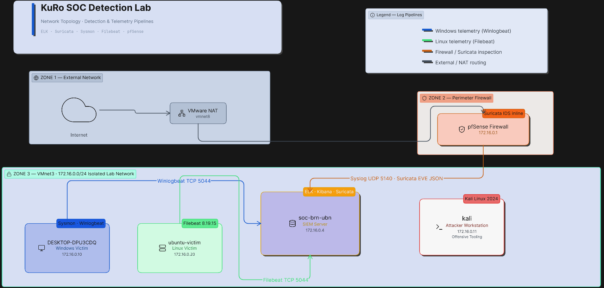

# SOC Detection Lab

> A detection-focused virtual SOC lab built for hands-on blue team skill development.
> Covers log ingestion, SIEM detection, adversary emulation, and incident response — all mapped to MITRE ATT&CK.

---

## Network Topology



> Full diagram details: [`architecture/README.md`](./architecture/README.md)

---

## Lab Overview

This lab simulates a real Security Operations Center (SOC) environment running entirely inside VMware Workstation. It is designed for detection engineering, incident response practice, and blue team portfolio building.

**Stack:** ELK (Elasticsearch · Logstash · Kibana) · Elastic Security · Suricata · Sysmon · Winlogbeat · Filebeat · pfSense

---

## VM Inventory

| Hostname | OS | IP | RAM | Role |
|---|---|---|---|---|
| `pfsense` | FreeBSD (pfSense 2.x) | 172.16.0.1 | 480 MB | Firewall · Gateway · Suricata IDS |
| `soc-brn-ubn` | Ubuntu 24.04.3 LTS | 172.16.0.4 | 3.8 GB | SIEM · ELK Stack · Kibana · Suricata |
| `DESKTOP-DPU3CDQ` | Windows 10 x64 | 172.16.0.10 | 2 GB | Windows Victim · Sysmon · Winlogbeat |
| `ubuntu-victim` | Ubuntu Linux | 172.16.0.20 | — | Linux Victim · Filebeat 8.19.15 · SSH target |
| `kali` | Kali Linux (rolling) | 172.16.0.11 | 3.8 GB | Attacker · Adversary Emulation |

> `ubuntu-victim` was added during [INC-009 — SSH Brute Force](./incidents/INC-009-ssh-bruteforce/). It ships `/var/log/auth.log` to Elasticsearch via Filebeat 8.19.15.

---

## Telemetry Pipeline

| Source | Agent | Destination | Index |
|---|---|---|---|
| Windows Event Logs + Sysmon | Winlogbeat 8.19.15 | Logstash TCP 5044 | `winlogbeat-*` |
| Linux Auth Logs (`/var/log/auth.log`) | Filebeat 8.19.15 | Logstash TCP 5044 | `filebeat-*` |
| Network IDS Alerts | Suricata → Filebeat | Elasticsearch | `suricata-*` |
| pfSense Firewall Logs | Syslog UDP 5140 + Suricata EVE JSON | Logstash | `pfsense-*` |

---

## Incident Log

| ID | Title | Tactic | Status |
|---|---|---|---|
| [INC-001](./incidents/INC-001-phishing/) | Phishing Simulation | Initial Access | ✅ Documented |
| [INC-002](./incidents/INC-002-powershell/) | PowerShell Execution | Execution | ✅ Documented |
| [INC-003](./incidents/INC-003-persistence/) | Persistence via Registry | Persistence | ✅ Documented |
| [INC-004](./incidents/INC-004-smb-bruteforce/) | SMB Brute Force | Credential Access | ✅ Documented |
| [INC-005](./incidents/INC-005-nmap-recon/) | Nmap Reconnaissance | Discovery | ✅ Documented |
| [INC-006](./incidents/INC-006-scheduled-task-privesc/) | Scheduled Task PrivEsc | Privilege Escalation | ✅ Documented |
| [INC-007](./incidents/INC-007-credential-dumping/) | Credential Dumping | Credential Access | ✅ Documented |
| [INC-008](./incidents/INC-008-pass-the-hash/) | Pass-the-Hash | Lateral Movement | ✅ Documented |
| [INC-009](./incidents/INC-009-ssh-bruteforce/) | SSH Brute Force (Linux) | Credential Access | ✅ Documented |

---

## MITRE ATT&CK Coverage

| Tactic | Techniques Covered |
|---|---|
| Initial Access | T1566 — Phishing |
| Execution | T1059.001 — PowerShell |
| Persistence | T1547 — Boot/Logon Autostart |
| Privilege Escalation | T1053 — Scheduled Task |
| Credential Access | T1110 — Brute Force · T1003 — Credential Dumping |
| Discovery | T1046 — Network Scan |
| Lateral Movement | T1550.002 — Pass-the-Hash |

---

## Repository Structure

```
SOC-Detection-Lab/
├── network-topology.png    — Lab network diagram (v2)
├── architecture/           — Topology docs and data flow tables
├── lab/
│   ├── infrastructure/     — Per-VM setup and IP inventory
│   └── telemetry-pipeline/ — Filebeat, Winlogbeat, Logstash configs
├── incidents/              — Incident cases (INC-001 → INC-009)
├── detections/             — Elastic Security rules and Sigma rules
├── detection-engineering/  — Rule design, validation, and upgrade paths
├── adversary-emulation/    — Attack simulation scripts and playbooks
├── evidence/               — Screenshots and artifacts per incident
├── exports/                — Exported Kibana dashboards and rules
├── threat-intelligence/    — IOC lists and TI feeds
├── automation/             — Helper scripts
├── metrics/                — Lab performance and coverage metrics
└── docs/                   — General documentation
```

---

## Author

**KuRo** — Blue Team · SOC Detection Engineering · Morocco
[GitHub: KuRo0x](https://github.com/KuRo0x)
