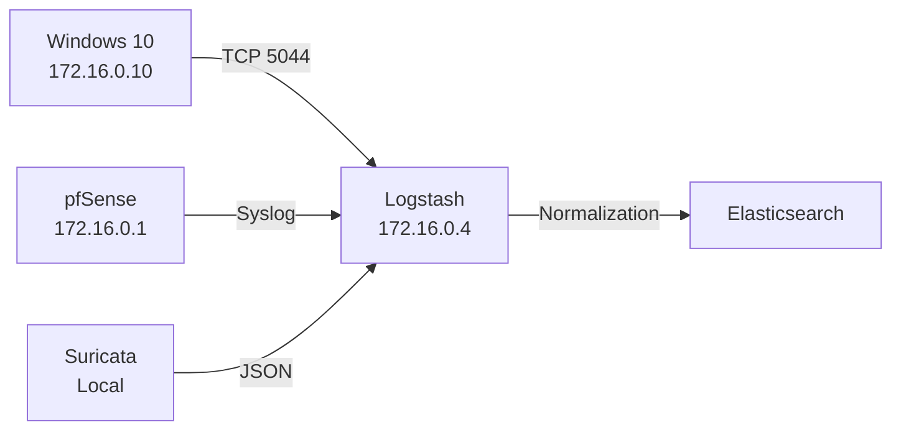

# Network Architecture

This document describes the network layout, trust boundaries, and traffic flow of the vSOC lab environment.  
All details reflect the **actual deployed topology**, not a theoretical design.

---

## 1. Network Overview

| Property | Value |
|---|---|
| Network Type | Isolated virtual network |
| Virtual Switch | VMnet3 |
| Address Space | 172.16.0.0/24 |
| Internet Access | Controlled via pfSense gateway |
| Host Access | No direct host-to-lab connectivity |

> The lab is intentionally **air-gapped from the host system** to safely simulate attacker behavior and enforce SOC-style containment.

---

## 2. IP Address Table

| Component | Role | IP Address |
|---|---|---|
| pfSense | Gateway / Firewall | 172.16.0.1 |
| Ubuntu Server | SIEM / ELK Stack | 172.16.0.4 |
| Windows 10 | Monitored Endpoint | 172.16.0.10 |

---

## 3. Traffic Flow

---

## 4. Trust Boundaries

- **pfSense** is the single enforced gateway — all traffic in/out passes through it
- **Endpoints** are treated as untrusted
- **SIEM** is a protected monitoring asset
- No lateral access between lab and host system

---

## 5. DNS Enforcement

- All DNS queries must route through pfSense
- Direct external DNS (port 53) from endpoints is **blocked**
- DNS violations are logged and forwarded to ELK
- Enables detection of DNS-based C2 bypass attempts

---

## 6. Isolation Rationale

VMnet3 isolation provides:
- Safe attack simulation without host risk
- Controlled egress for detection engineering
- Predictable traffic paths for Suricata inspection
