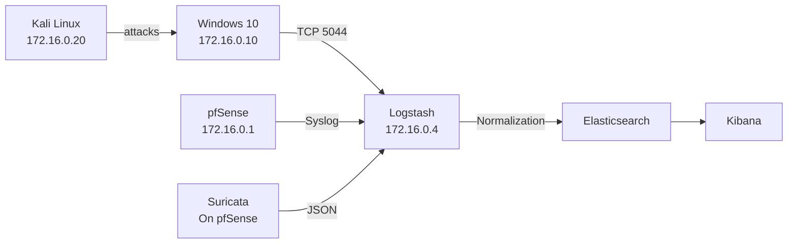

# Network Architecture

This document describes the network layout, trust boundaries, and traffic flow of the SOC Detection Lab environment.  
All details reflect the **actual deployed topology**, not a theoretical design.

---

## 1. Network Overview

- **Network Type:** Isolated virtual network  
- **Virtual Switch:** VMnet3  
- **Address Space:** 172.16.0.0/24  
- **Internet Access:** Controlled via gateway (pfSense)  
- **Host Access:** No direct host-to-lab connectivity  

> **Note:** The lab is intentionally **air-gapped from the host system** to safely simulate attacker behavior and enforce SOC-style containment.

---

## 2. Network Topology

### 2.1 Virtual Machines and IP Roles

| Component | Role | IP Address | Network |
|-----------|------|------------|---------|
| pfSense | Gateway / Firewall | 172.16.0.1 | VMnet3 |
| Ubuntu Server | SIEM / ELK Stack | 172.16.0.4 | VMnet3 |
| Windows 10 | Victim Endpoint | 172.16.0.10 | VMnet3 |
| Kali Linux | Attacker | 172.16.0.20 | VMnet3 |

All systems reside on the same **private subnet** and communicate only through defined paths.

---

## 3. Trust Boundaries

### 3.1 Gateway Boundary (pfSense)

pfSense acts as the **single trust boundary** between:
- Internal lab systems
- External networks

All inbound and outbound traffic is subject to:
- Firewall rules
- DNS enforcement policies
- Logging and inspection

### 3.2 Internal Trust Model

| System | Trust Level |
|--------|-------------|
| Endpoints (Windows, Kali) | Untrusted |
| SIEM (Ubuntu ELK) | Protected monitoring asset |
| Gateway (pfSense) | Security enforcement infrastructure |

This mirrors real SOC environments where detection systems are hardened and endpoints are potential compromise points.

---

## 4. Traffic Flow

### 4.1 Architecture Diagram



### 4.2 Endpoint Telemetry

```
Windows 10 (172.16.0.10)
→ Winlogbeat (TCP 5044)
→ Logstash (172.16.0.4)
→ Elasticsearch
```

### 4.3 Network Telemetry

```
pfSense (172.16.0.1)
→ Syslog
→ Logstash (172.16.0.4)
→ Elasticsearch
```

### 4.4 IDS Telemetry

```
Suricata (running on pfSense)
→ JSON alert output
→ Logstash
→ Elasticsearch
```

---

## 5. DNS Enforcement Model

pfSense acts as the authoritative DNS path for the lab.

- Direct external DNS access from endpoints is **blocked**
- All DNS queries are observable and logged
- Prevents DNS-based C2 bypass
- Enables policy-based detection of DNS violations

---

## 6. Isolation Rationale

The use of VMnet3 provides:
- Safe attack and malware simulation
- No risk to the host system
- Controlled egress points
- Predictable traffic paths for detection engineering
